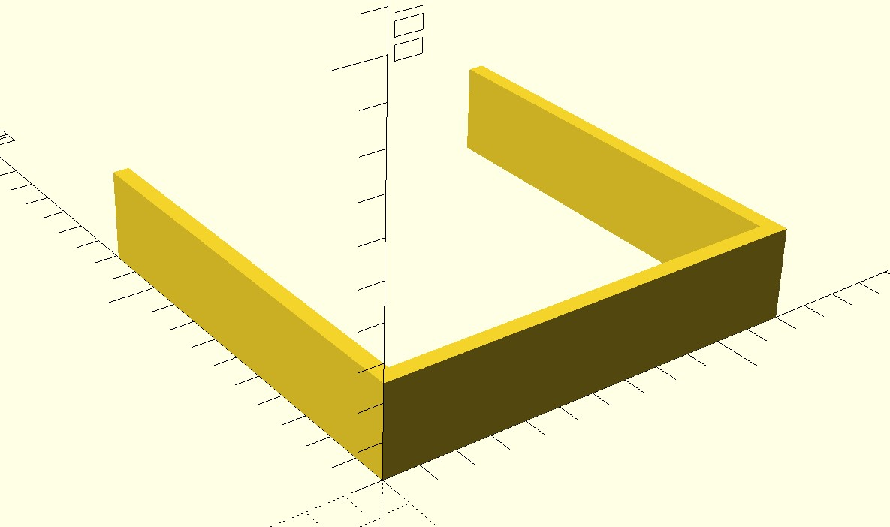
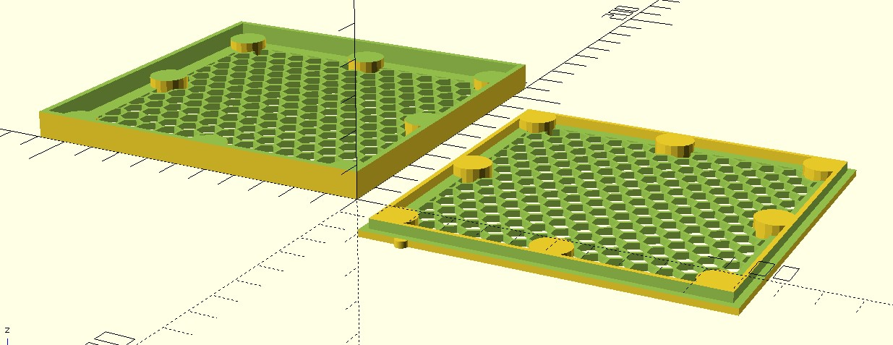

# Parametric Air Filter Frame

This project is a OpenSCAD parametric Air Filter Frame.  It's a design for a frame that can be filled with either HEPA filter medium or activated carbon to be used in air filters.

The frame is originally designed to be used in conjunction with the [AirManagerV2](https://www.printables.com/model/16996-airmanagerv2-recirculating-air-filter-for-3d-print), either as a whole frame insert, create your own HEPA and carbon set, or a carbon filter to go with another purchased HEPA filter.  The filter set suggested wit the AirManagerV2 is hard to source in the US, however there are several close HEPA filters in size (but don't have a matching carbon filter) and are smaller than the whole device.

This project generates two main components: 1) Filter Spacer 2) Air Filter Frame (top and bottom), each of these are parameterized as much as possible to allow for you to generate ones of different sizes.  It's not required to use it with the AirManagerV2, but that's what dimensions it uses as the default values.

## Filter Spacer

The spacer is meant to help make a smaller filter fit into the AirManagerV2 (or any other filter holder) and keep it centered.  The default dimensions of 120x120x26mm for the scad file are the interior dimensions of the AirManagerV2 filter compartment.

For example if you buy a HEPA filter measuring 110x110x15mm, you'll get a spacer to fit three sides that will measure 10mm thick and 26mm tall (height of the compartment).

## Filter Frame

The filter frame is composed of two parts a top and a bottom and held together by 8 pairs of magnets (probably overkill) which are embedded in the cylinders about 1.5mm from the surface.  I purchased 10x2mm magnets which work out fine but you can adjust the size of the magnets your purchase in the parameters.

The size of the frame can be created by 1 of ways: 1) remaining space from a HEPA filter 2) custom size

### Remaining Space Sizing

This method essentially creates a matching carbon cartridge to a HEPA filter you purchase and uses the remaining space in the compartment to determine size.  This method will be used as long as all the dimensions prefixed with "custom_filter_*" are left at -1.

For example, given the compartment dimensions of 120x120x26mm and a HEPA filter size of 110x110x15mm.  It will create a filter frame the size of 110x110x11mm, which can then be filled with activated carbon to make a set.

### Custom Sizing

This method will create a filter frame of the size of your choosing.  Either creating a single frame to be filled with all carbon, or you can make two matching frames and fill one with filter material and the other with carbon.